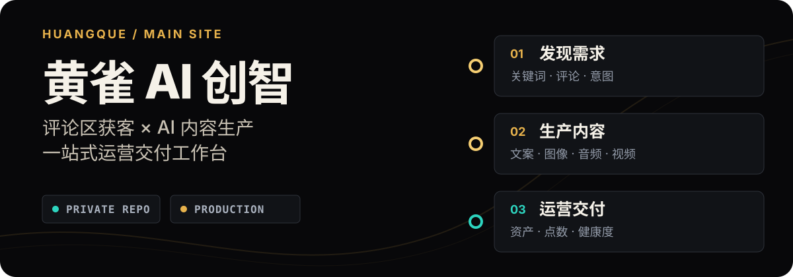

<p align="center">
  
</p>

# 黄雀 AI 创智 · 主站

**评论区获客 + AI 内容生产的一站式工作台。** 黄雀把内容采集、意图筛选、文案、作图、配音、视频、资产与运营管理串成一条可交付的生产线。

> 私有生产仓库，请勿公开。生产站：[huangquechuanmei.com](https://huangquechuanmei.com) · 运营后台：`/admin-console`

[AI 协作规则](AGENTS.md) · [团队 Git 规矩](docs/团队Git协作规矩.md) · [视觉规范](DESIGN.md) · [生产与恢复手册](deploy/生产环境清单与还原手册.md)

---

## 产品闭环

1. **发现需求** — 从抖音、小红书、视频号采集内容与评论，筛出有明确意图的客户线索。
2. **生产内容** — 用文案、图片、音频、数字人与视频能力完成创作。
3. **沉淀资产** — 统一保存形象、音色、素材与生成结果，方便复用和交付。
4. **运营管理** — 用点数、任务、渠道健康、日志和充值审批控制成本与风险。

平台统一使用账号与点数体系：任务提交时预扣，失败自动退点；生成任务进入异步队列，完成后回到资产库。

## 核心工作台

前端唯一正本位于 [`site/workbench/`](site/workbench/)；`huangque-web/` 是历史副本，不再作为修改入口。

| 场景 | 页面 | 主要能力 |
|---|---|---|
| 今日行动 | `dashboard.html` | 工作台概览、任务与经营状态 |
| 内容生产 | `script.html` · `banana.html` · `audio.html` · `video.html` | 文案、作图、配音、数字人与多类视频 |
| 采集获客 | `collect.html` · `leads.html` | 内容采集、转写、评论意图筛选与客户名单 |
| 资产交付 | `assets.html` · `bots.html` | 素材与作品管理、飞书 Bot 协作 |
| 创意辅助 | `inspiration.html` · `canvas.html` | 灵感案例与实验性节点画布 |
| 经营设置 | `cost.html` · `recharge.html` · `settings.html` | 成本、充值、账号与权限设置 |

## 运营后台

`site/admin/index.html` 与 `server/admin_api.py` 共同提供管理员控制台：

- **渠道与服务健康**：逐项拨测内部服务和外部渠道；计费接口不提供误触式测试。
- **任务与请求时间线**：合并任务记录与 nginx 请求，敏感查询参数自动打码。
- **功能开关**：按模块停用提交入口，维护期间不扣点。
- **用户与点数**：账号管理、原子加减点和完整流水。
- **充值审批**：到账后加点，所有写操作保留审计。

后台接口不返回密钥真值；非管理员访问统一返回 `403`。

## 系统结构

```text
用户浏览器
    │
    ▼
https://huangquechuanmei.com  ·  nginx / TLS
    │
    ├── 静态工作台                         site/
    ├── /api/auth/*    ──► 鉴权与点数       :8095
    ├── /api/gen/*     ──► 内容任务主服务   :8096
    │                         ├── 作图       :8101
    │                         ├── 下载代理   :8097
    │                         └── 采集获客   :8100
    └── /api/admin/*   ──► 运营后台         :8098
```

| 服务 | 代码入口 | 职责 |
|---|---|---|
| `huangque-auth` | `server/auth_server.py` | 账号、令牌、点数、充值与审计 |
| `huangque-content` | `server/content_api.py` | 内容生成任务与渠道调度 |
| `huangque-imggen-api` | `server/imggen_api.py` | 作图与图片反推 |
| `huangque-dl` | `server/dl_service.py` | 受控下载代理与 SSRF 防护 |
| `huangque-leadgen-api` | `server/leadgen_api.py` | 内容采集与获客 |
| `huangque-admin` | `server/admin_api.py` | 健康、日志、用户与审批 |

实时渠道状态以运营后台拨测为准；不要根据 README、配置名称或进程存在推断服务可用。

## 开发与协作

从最新 `main` 建独立分支，所有改动通过 PR 和「代码与安全门禁」进入主线。

```bash
git fetch origin --prune
git switch main
git pull --ff-only
git switch -c codex/<任务名>
```

本地校验：

```bash
python3 -m unittest discover -s tests
python3 scripts/ci_validate.py
python3 scripts/stamp_assets.py --check
find site -type f -name '*.js' -print0 | xargs -0 -n1 node --check
(cd design-system && npm ci && npm run build)
```

公共入口、数据库结构和工作台共享文件的修改边界，请先看 [`AGENTS.md`](AGENTS.md) 与 [`docs/团队Git协作规矩.md`](docs/团队Git协作规矩.md)。

## 部署边界

- 生产服务器是部署目标，不是代码正本。
- 合并 `main` 后，只部署本次改过的文件；禁止用旧目录整站覆盖。
- 部署前确认目标、漂移、依赖与回滚方式；部署后检查服务状态、关键日志和真实业务请求。
- 数据库、任务产物、用户数据与密钥不随代码发布。

完整拓扑、备份、回滚和验证步骤见 [`deploy/生产环境清单与还原手册.md`](deploy/生产环境清单与还原手册.md)。

## 仓库地图

```text
server/          后端服务与内容领域模块
site/            前端正本、运营后台与 API 文档
tests/           自动化测试
scripts/         CI 校验、部署与运维工具
deploy/          nginx、systemd 与生产手册
docs/            协作规则、工单与系统档案
worker/          Mac 端住宅网络采集 worker
design-system/   React / Vite 设计系统
knowledge/       项目知识资料
archive/         历史归档
huangque-web/    遗留副本，请勿修改
```

获客系统的来源、混合部署方式和风控经验见 [`docs/获客系统-douyin-leadgen.md`](docs/获客系统-douyin-leadgen.md)。

## 安全红线

- 密钥、密码、Cookie、数据库、用户数据与生成产物永不进入 Git。
- 仓库保持私有；客户名单和评论数据不得外发或用于不当触达。
- 后台、日志和接口响应不得显示密钥真值。
- 删除、覆盖、回滚、真实支付与数据库结构变更必须先确认目标和恢复方案。
