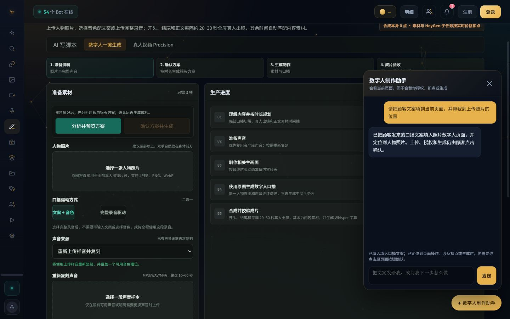
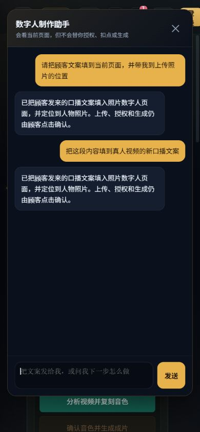

# Digital-human one-click Agent browser evidence

This evidence was captured from the real
`site/workbench/digital-human-oneclick.html` and
`site/workbench/script-agent.js` in the Codex in-app browser. A local HTTP
fixture supplied deterministic health, submission, and job responses; it did
not replace the product HTML or JavaScript. No test or production server was
contacted.

## Desktop, 1440 x 900

The browser submitted a customer request, filled `浏览器验收口播文案` into
the photo-mode script field, and focused the next safe control. The customer
authorization checkbox remained clear and the generation button remained
disabled. Screenshot SHA-256:
`0c98ba69c171f4696c9cf1a10732c1476eb3d7d0e79beb2b7b973c9019535730`.

The same desktop run switched to Precision video mode. A second Agent request
filled the Precision script field while `dhConsent` remained false,
`dhStart.disabled` remained true, and the page continued to report that a
customer video upload was required.

## Mobile, 390 x 844

The panel, close control, input, and send control were visible without
horizontal overflow (`scrollWidth=390`, viewport width `390`). The final Agent
launcher rectangle did not overlap either original action button:

| Control | Top | Bottom | Launcher overlap |
| --- | ---: | ---: | --- |
| Agent launcher | 706.67 | 750.00 | n/a |
| Analyze | 761.58 | 805.58 | false |
| Generate | 813.58 | 857.58 | false |

Screenshot SHA-256:
`dbcc6284140e2c61c6c8644308f9d1584e2448a16b46c483bbd285d00fd3027f`.

## Interaction assertions

| Scenario | Browser-observed result |
| --- | --- |
| Feature disabled | The Agent launcher was not mounted. |
| Feature enabled | The digital-human launcher and panel mounted normally. |
| Photo mode fill | Customer text was written into `#script`. |
| Precision mode fill | Customer text was written into `#dhScript`. |
| Customer confirmation | Photo and Precision authorization remained unchecked; neither generation control was clicked. |
| Mobile layout | No horizontal overflow and no overlap with the original analyze/generate actions. |

The Agent is permitted to fill customer-provided content, select safe options,
switch the active digital-human mode, navigate inside Huangque, and focus an
original control. Upload, authorization, analysis/generation submission,
deletion, and publication remain customer-click operations.
