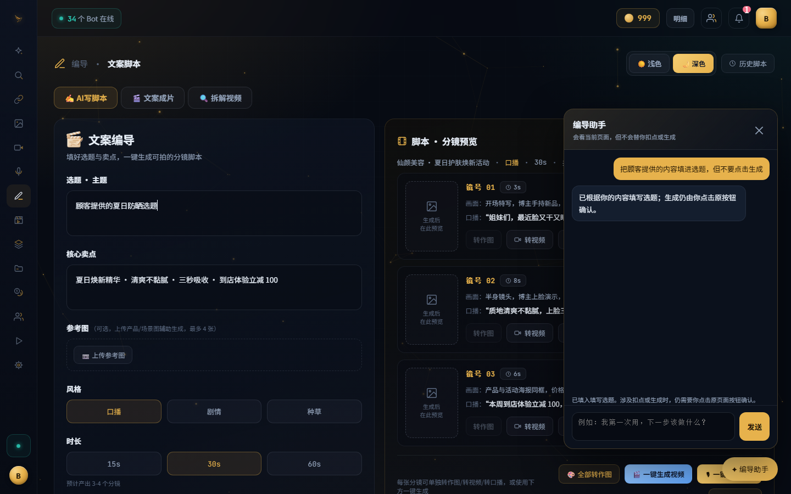
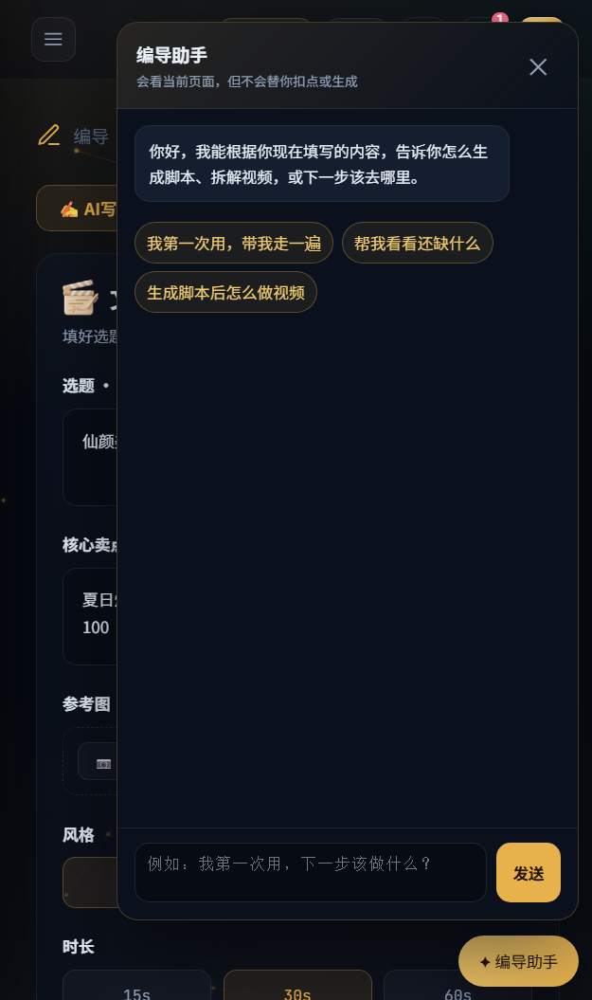

# PR #276 browser acceptance evidence

This evidence was captured from the real `site/workbench/script.html` and
`site/workbench/script-agent.js` at runtime source commit `9ec4d250af6dc2c0b7443ae9a2443dd1c7c38483`.
The local HTTP fixture only supplied deterministic API responses, recorded
requests, and drove clicks/reload; it did not replace the product UI files.
No test or production server was contacted.

Browser: Google Chrome `150.0.7871.187`, headless-new mode.

## Screenshots

### Desktop, 1440 x 900

Observed from the rendered DOM:

- feature enabled: launcher and panel were visible;
- customer content was filled into the topic field;
- `生成脚本（3 点）` remained an unclicked customer-confirmation button;
- the launcher did not overlap the generate or upload buttons;
- the page remained scrollable behind the fixed panel.

Screenshot SHA-256:
`1dff16435cff579cc7daabff7f882ff8bb4389a0b4b9509aae4ecc7fd73204ef`.

### Narrow/mobile layout, 500 x 844 CSS launch window at 1.25 scale

Observed from the rendered DOM:

- the narrow-screen layout opened with the input and send controls visible;
- the launcher did not overlap the generate or upload buttons;
- the original generate and upload controls remained customer-operated.

Screenshot SHA-256:
`4d833bbb885e2f136180dc5c097dff14e4603b549accd1fd783c5516f2d99d38`.

## Browser interaction assertions

The same browser run exercised these additional states:

| Scenario | Browser-observed result |
| --- | --- |
| Feature disabled | `#hqDirectorAgent` was absent while the original `#scGen` button remained present. |
| Refresh recovery | The page reloaded while job `77` was pending, resumed polling it, and applied its completed result. Only one Director Agent POST was recorded for that scenario. |
| Stale action | A mismatched `page_revision` was rejected with `页面内容已变化，请重新让编导助手判断`; the old action was not applied. |
| Customer confirmation | The fixture trapped every non-Agent POST. The recorded list stayed empty, so generation, upload, deletion, and publication were not invoked by the Agent. |

Across the desktop, stale-revision, and refresh-recovery submissions, the
fixture recorded three Director Agent POSTs with three distinct idempotency
keys and zero paid or mutating POSTs.
